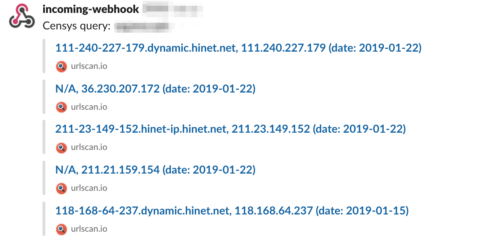
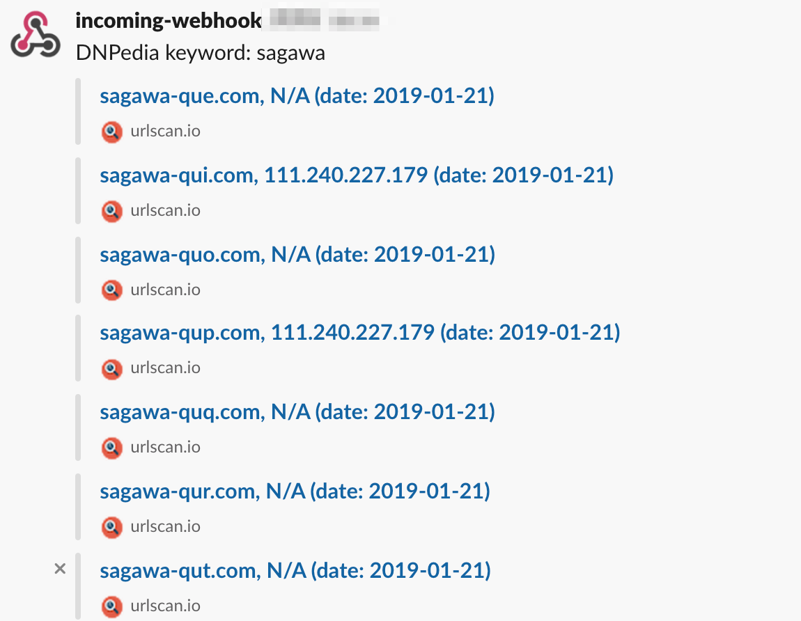

# Osakana

[](https://badge.fury.io/rb/osakana)
[](https://travis-ci.org/ninoseki/osakana)
[](https://coveralls.io/github/ninoseki/osakana?branch=master)

Osakana is a Swiss army knife tool for my phishing research.

## Features

- Censys lookup
- Check newly registered domains on DNPedia by keyword
- Slack integration

## Prerequisites

- Ruby (> 2.5)

## Install

```shell
gem install osakana
```

## Usage

```shell
$ osakana
Commands:
  osakana censys_lookup [QUERY]          # lookup on Censys by a given query
  osakana check_newly_domains [KEYWORD]  # check newly registered domains on DNPedia by a given keyword
  osakana help [COMMAND]                 # Describe available commands or one specific command
```

## Configuration

### Censys

Please set the following environmental variables for enabling Censys lookup.

- CENSYS_ID: your Censys API ID
- CENSYS_SECRET: your Censys secret key

### Slack

Please set the following environmental variables for enabling Slack integration.

- SLACK_WEBHOOK_URL: A Slack webhook URL.
- SLACK_CHANNEL_NAME: A Slask channel name which will be notified.

## Screenshots

### `osakana censys_lookup`



### `osakana check_newly_domains`


